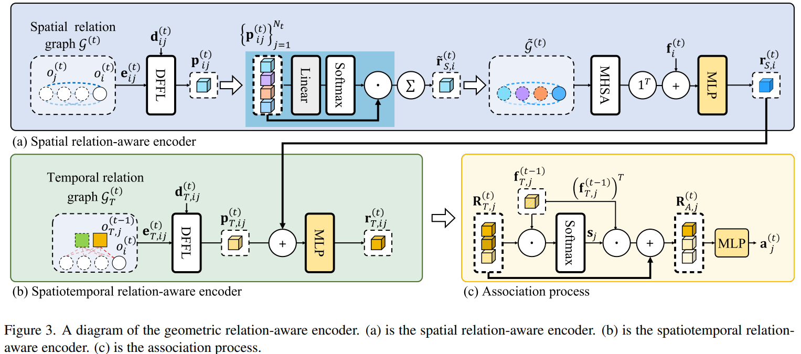

# GRAE-3DMOT: Geometry Relation-Aware Encoder for Online 3D Multi-Object Tracking    


# Introduction
This repo is the official Code ofGRAE-3DMOT: Geometry Relation-Aware Encoder for Online 3D Multi-Object Tracking (CVPR 2025). This is a beta version, so bugs may exist. We are currently working on code modifications.

# Abstract
Recently, 3D multi-object tracking (MOT) has widely adopted the standard tracking-by-detection paradigm, which solves the association problem between detections and tracks. Many tracking-by-detection approaches establish constrained relationships between detections and tracks using a distance threshold to reduce confusion during association. However, this approach does not effectively and comprehensively utilize the information regarding objects due to the constraints of the distance threshold. In this paper, we propose GRAE-3DMOT, Geometry Relation-Aware Encoder 3D Multi-Object Tracking, which contains a geometric relation-aware encoder to produce informative features for association. The geometric relation-aware encoder consists of three components: a spatial relation-aware encoder, a spatiotemporal relation-aware encoder, and a distance-aware feature fusion layer. The spatial relation-aware encoder effectively aggregates detection features by comprehensively exploiting as many detections as possible. The spatiotemporal relation-aware encoder provides spatiotemporal relation-aware features by combing spatial and temporal relation features, where the spatiotemporal relation-aware features are transformed into association scores for MOT. The distance-aware feature fusion layer is integrated into both encoders to enhance the relation features of physically proximate objects. Experimental results demonstrate that the proposed GRAE-3DMOT outperforms the state-of-the-art on the nuScenes. Our approach achieves 73.7\% and 70.2\% AMOTA on the nuScenes validation and test sets using CenterPoint detections.

<p align="center">  </p>   

# Setup environment
**1. create a conda virtual environment**
```shell
conda create -n grae3dmot python=3.8 -y
conda activate grae3dmot
```

**2. install pytorch and torch vision**
```shell
pip install torch==1.9.0+cu111 torchvision==0.10.0+cu111 torchaudio==0.9.0 -f https://download.pytorch.org/whl/torch_stable.html
```
**3. install dependencies**
```shell
pip install pandas==1.4.0
pip install fvcore==0.1.5.post20221221
pip install nuscenes-devkit matplotlib motmetrics==1.1.3
```

**4. to enable using BEV IoU as matching distance for target assignment, please install the iou3d_nms CUDA operation from CenterPoint:**
```
git clone https://github.com/tianweiy/CenterPoint.git
cd CenterPoint/det3d/ops/iou3d_nms/
export CUDA_HOME=/usr/local/cuda-11
python setup.py install
```
**5. to apply NMS during data pre-processing following SimpleTrack, please install:**
```
git clone https://github.com/tusen-ai/SimpleTrack.git
cd SimpleTrack/
pip install -e .
```

# Dataset preparation

**1. Download nuScenes**

Download the [nuScenes dataset](https://nuscenes.org/download)."


**2. Get nuScenes CenterPoint detection results**

Most existing MOT paper use [CenterPoint](https://github.com/tianweiy/CenterPoint) as public detection due to its better performance.

Following this [Github issue](https://github.com/tianweiy/CenterPoint/issues/249), you can download CenterPoint public detections that are provided by the authors:
- [With flip augmentation](https://mitprod-my.sharepoint.com/:f:/g/personal/tianweiy_mit_edu/Eip_tOTYSk5JhdVtVzlXlyABDPnGx9vsnwdo5SRK7bsh8w?e=vSdija) (68.5 NDS val performance)
- [Without flip augmentation](https://mitprod-my.sharepoint.com/:f:/g/personal/tianweiy_mit_edu/Er_nsH9Z2tRHnptBFJ_ompAByE3zu4E88xae691xyS6q_w?e=UqTmU2) (66.8 NDS val performance)

**3. Data pre-processing**

Please rename the json files with detection results for train, validation, and test as train.json, val.json and test.json.

Please save each file to its designated location.
```
center_point_det
├── train.json
├── val.json
├── test.json
```

Use this `script` to pre-process the detections
```
python tools/convert_dataset.py
```
By default, `train.json` is used as the input. If you want to convert `validation.json`, please modify `mod="train"` to `mod="val"` in the main code of `convert_dataset.py`. (Note: This code is currently in beta, and we plan to allow users to customize arguments in the future.)


# Train & Eval

**1. Train**

The beta version of the code provides separate training implementations for single-GPU and multi-GPU setups.
```shell
# single GPU
python single_gpu_train.py

#multiple GPU
python -m torch.distributed.launch --nproc_per_node=$GPU_NUM train.py
```

**2. Evaluation**

Evaluation can be performed using the trained parameters. Please refer to the official NuScenes website for the evaluation of the test set.
```shell
python validation.py -r $CHECK_POINT_PATH -d cuda:0 -o $OUTPUT_PATH
```

# Results

We achieved the state-of-the art on nuScenes dataset.
<p align="center">  </p>  

**License**

###### Part of the code of project GRAE-3DMOT are taken from CenterPoint and 3DMOTFormer #####
###### Pytorch Template Project (https://github.com/victoresque/pytorch-template) #####
##### We plan to provide a detailed update on the license information  #####
